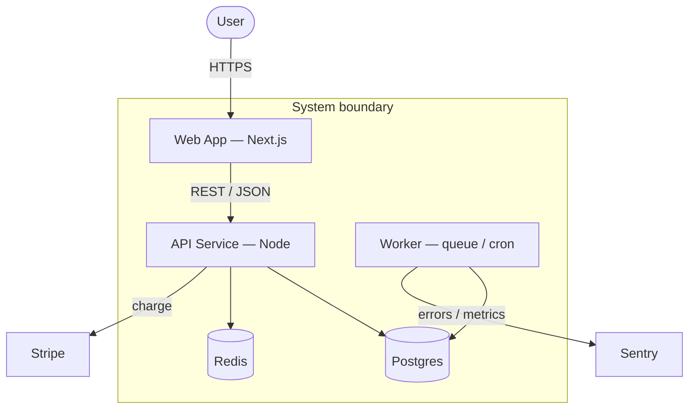

# Update Codemaps

Analyze the codebase structure and generate token-lean architecture documentation.

## Step 1: Scan Project Structure
1. Identify the project type (monorepo, single app, library, microservice)
2. Find all source directories (src/, lib/, app/, packages/)
3. Map entry points (main.ts, index.ts, app.py, main.go, etc.)

## Step 2: Generate Codemaps
Create or update codemaps in `docs/codemaps/`:

| File | Contents |
|------|----------|
| `architecture.md` | High-level system diagram, service boundaries, data flow |
| `backend.md` | API routes, middleware chain, service → repository mapping |
| `frontend.md` | Page tree, component hierarchy, state management flow |
| `data.md` | Database tables, relationships, migration history |
| `dependencies.md` | External services, third-party integrations, shared libraries |

### Diagrams (REQUIRED — Mermaid, not ASCII)
Every codemap that describes structure or flow MUST include at least one **Mermaid** diagram in a ```mermaid fenced block``` (GitHub/most viewers render it). ASCII art is not allowed for these. Use the right diagram type per file:

| File | Required Mermaid diagram |
|------|--------------------------|
| `architecture.md` | **Container view (C4 Level 2)** — the single best overview: every runnable/deployable unit (web app, API/service, workers/cron), datastores, and external systems, inside a system boundary, with labeled interactions (protocol/purpose). NOT internal classes/functions. |
| `backend.md` | `flowchart LR` — request lifecycle (route → controller → service → repo → store) |
| `frontend.md` | `graph TD` — page/route tree → component hierarchy |
| `data.md` | `erDiagram` — tables + relationships |
| `dependencies.md` | `flowchart LR` — app → external services/integrations |

Example (`architecture.md` — **container view**: each node is a runnable container or datastore, external systems sit outside the boundary, edges are labeled interactions):

(Prefer Mermaid's native `C4Container` syntax if your renderer supports it; otherwise use the labeled `flowchart` + `subgraph` boundary above — it renders everywhere.)

### Codemap Format
Each codemap should be token-lean — optimized for AI context consumption:

```markdown
# Backend Architecture

## Routes
POST /api/users → UserController.create → UserService.create → UserRepo.insert
GET  /api/users/:id → UserController.get → UserService.findById → UserRepo.findById

## Key Files
src/services/user.ts (business logic, 120 lines)
src/repos/user.ts (database access, 80 lines)

## Dependencies
- PostgreSQL (primary data store)
- Redis (session cache, rate limiting)
- Stripe (payment processing)
```

## Step 3: Diff Detection
1. If previous codemaps exist, calculate the diff percentage
2. If changes > 30%, show the diff and request user approval before overwriting
3. If changes <= 30%, update in place

## Step 4: Add Metadata
Add a freshness header to each codemap:
```markdown
<!-- Generated: 2026-02-11 | Files scanned: 142 | Token estimate: ~800 -->
```

## Step 5: Save Analysis Report
Write a summary to `.reports/codemap-diff.txt`:
- Files added/removed/modified since last scan
- New dependencies detected
- Architecture changes (new routes, new services, etc.)
- Staleness warnings for docs not updated in 90+ days

## Tips
- Focus on **high-level structure**, not implementation details
- Prefer **file paths and function signatures** over full code blocks
- Keep each codemap under **1000 tokens** for efficient context loading
- Use **Mermaid** diagrams (```mermaid blocks) for all structure/data-flow — never ASCII art (see "Diagrams (REQUIRED)" above)
- Run after major feature additions or refactoring sessions

Invokes the `codemap` agent.
