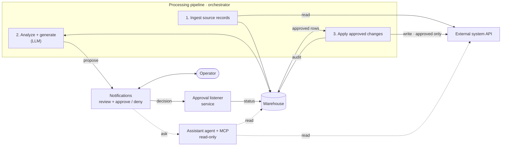

# Container Diagram — Ideate → C4 Container View

Turn a rough idea, brief, or notes into a clear **C4 Level-2 "container" diagram**: the best single-glance map of a system's architecture. A *container* = an independently runnable/deployable unit (web app, API/service, worker, mobile app) or a datastore — **not** a class or function (that is C4 L3/L4). Stay at that altitude.

## When to use
The user wants to think through or sketch a system's architecture, or asks for a container diagram from an idea, feature brief, RFC, or meeting notes.

## Step 1 — Intake (ask only what's missing)
From the user's input, extract: **what's being built**, core capabilities, who/what the clients are, scale & latency constraints, must-use or preferred tech, and the external systems it must talk to (payments, auth, email, analytics, 3rd-party APIs). If 2–3 of these are genuinely unclear **and** would change the diagram, ask one short batch of questions; otherwise proceed on reasonable assumptions and label them.

## Step 2 — Ideate the containers
Decide the **containers** (runnable units + datastores) and the **external systems**:
- **Clients / edge:** web app, mobile, CLI, public API consumers.
- **Compute:** API/service(s), background workers, schedulers/cron, queue/stream processors.
- **Data:** primary DB, cache, object storage, search index, vector store.
- **External systems:** third-party APIs / SaaS the system depends on.

Give each a one-line responsibility. Pick the **simplest set that satisfies the brief** — do not over-decompose. Capture 2–3 key trade-offs (e.g. why a worker, why a cache, sync vs async).

## Step 3 — Output the Mermaid container diagram (the deliverable)
Emit a renderable **container view** in a ```mermaid fenced block```:
- Each node = a container or external system. Datastores as `[( )]`, actors as `([ ])`, queues as `[[ ]]`.
- Wrap the system's own containers in a `subgraph` **system boundary**; external systems sit outside it.
- **Every edge is labeled** with the interaction — purpose (+ protocol where it matters), and make read vs write explicit, e.g. `read`, `propose`, `write · approved only`, `audit`.
- Direction flows caller → callee; avoid cycles between containers.

**Style conventions (use these — they make the diagram readable in one glance):**
- **Orientation `flowchart LR`** — left→right reads as a flow; use `TD` only for a strongly hierarchical system.
- **Sub-labels** — add a one-line descriptor under a node's name with `<br/>` (its tech or role), e.g. `API["API service<br/>read-only"]`.
- **Numbered pipeline** — group the core processing steps in a `subgraph` and number them `1. … 2. … 3. …` so the sequence is obvious.
- **Solid vs dashed** — **solid** edges for the primary / write path; **dashed** edges (`-. "label" .->`) for secondary, read-only, or assistant/agent paths.
- **`%%` headers** — precede each flow group with a comment, e.g. `%% Primary flow (solid)` / `%% Read-only path (dashed)`.
- **Shapes** — actors `([ ])`, datastores `[( )]`, queues `[[ ]]`, services/containers `[ ]`.
- Keep human-in-the-loop steps (review / approve / deny) visible whenever the system has them.

Example — **reproduce the STYLE, not these specific names** (generic, renders in GitHub/Notion/Slack/most viewers):

(If the target renderer supports it, you may instead emit native Mermaid `C4Container` syntax — same content, C4 styling.)

### Also emit a shareable rendered LINK (REQUIRED)
After the code block, output **two links that render this exact diagram** — an editable one and an image one — so it can be shared without a Mermaid-aware viewer. Build them deterministically: pako-encode the diagram (zlib-deflate the Mermaid-Live state JSON, then URL-safe base64 with padding stripped). Run whichever runtime is available — paste the EXACT mermaid code into `code`:

Python:
```python
import json, zlib, base64
code = r"""<PASTE THE EXACT MERMAID CODE>"""
payload = json.dumps({"code": code, "mermaid": {"theme": "default"}}).encode()
b64 = base64.urlsafe_b64encode(zlib.compress(payload, 9)).decode().rstrip("=")
print("Edit:  https://mermaid.live/edit#pako:" + b64)
print("Image: https://mermaid.ink/img/pako:"  + b64)
```

Node:
```js
const zlib = require("zlib");
const code = `<PASTE THE EXACT MERMAID CODE>`;
const payload = JSON.stringify({ code, mermaid: { theme: "default" } });
const b64 = zlib.deflateSync(Buffer.from(payload)).toString("base64")
  .replace(/\+/g, "-").replace(/\//g, "_").replace(/=+$/, "");
console.log("Edit:  https://mermaid.live/edit#pako:" + b64);
console.log("Image: https://mermaid.ink/img/pako:"  + b64);
```

Both URLs encode the diagram in the link itself (no upload). `mermaid.live/edit` opens it editable; `mermaid.ink/img` is a direct PNG (good for Slack/Notion/docs). If no runtime is available, still output the code and tell the user to paste it at https://mermaid.live.

## Step 4 — Legend + assumptions (below the diagram)
- A short **container table**: `| Container | Responsibility | Tech |`.
- The **assumptions** you made, and 2–3 **open questions / decisions** that would change the shape.
- One line on the obvious next zoom-in (which container to expand into a component diagram).

## Rules
- Stay at **container altitude** — no functions/classes. If asked to go deeper, that's a separate component (C4 L3) diagram.
- **Always** emit a renderable Mermaid block — never ASCII.
- **Final output order:** (1) the Mermaid code block, (2) the **Edit** + **Image** links, (3) the container table + assumptions/open questions.
- Keep it to the simplest architecture that meets the brief; clearly flag anything speculative.
